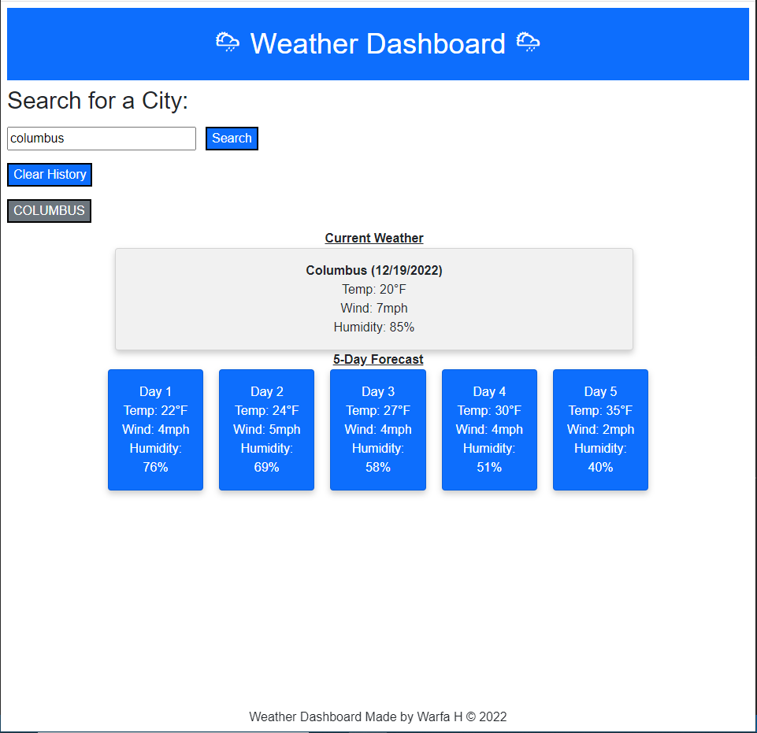

# Reporting-the-Weather

## Description

This week, we had to use the OpenWeather API to retrieve weather data and build a weather dashboard. It displays the current weather and 5 day forecast of any city the user searches. 

## Table of Contents 

1. Screenshot
2. Installation
3. Usage
4. Credits
5. License

## Screenshot

Deployed Site:

## Installation
N/A 

## Usage

When the user searches for a city
THEN the user am presented with current and future conditions for that city and that city is added to the search history
WHEN the user view current weather conditions for that city
THEN the user am presented with the city name, the date, an icon representation of weather conditions, the temperature, the humidity, and the the wind speed
WHEN the user view future weather conditions for that city
THEN the user am presented with a 5-day forecast that displays the date, an icon representation of weather conditions, the temperature, the wind speed, and the humidity
When the user clickes clear history, it will previous searches

## Credits

Weather data provided by OpenWeather https://openweathermap.org/

## License

Refer to the license in the repo.